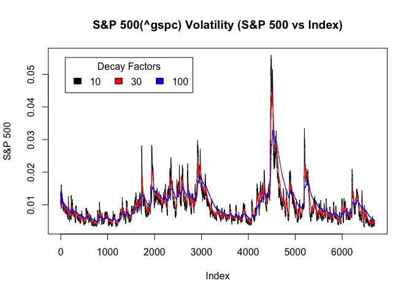

# Assignment11 SP500 Volatility
Cam Lu  
7/27/2017  


# Analysis 
The packages "tseries" and "zoo" will need to install and enable for the code to run besides the base R programing package. The plot() function from base R package is used that will not need install and enable ggplot2 package.

The goal of this project is to analyse volatility of S&P 500 index fund with ticker symbol of ^GSPC from 1991-01-02 to 2017-07-27. The raw financial data was downloaded from yahoo financial site.


- Download historical finance data from yahoo data provider

		SNPdata <- get.hist.quote('^gspc',quote="Close")

- SNPdata index fund starts from 326.45 points on 1991-01-02 and end with 2475.42 on 2017-07-27
		
		head(SNPdata)
		            Close
		1991-01-02 326.45
		1991-01-03 321.91
		1991-01-04 321.00
		1991-01-07 315.44
		1991-01-08 314.90
		1991-01-09 311.49
		
		tail(SNPdata)
		             Close
		2017-07-20 2473.45
		2017-07-21 2472.54
		2017-07-24 2469.91
		2017-07-25 2477.13
		2017-07-26 2477.83
		2017-07-27 2475.42

- Calculate log reture.
		
		SNPret <- log(lag(SNPdata)) - log(SNPdata)

- SNPret data
		
		head(SNPret)
		                  Close
		1991-01-02 -0.014004819
		1991-01-03 -0.002830893
		1991-01-04 -0.017472627
		1991-01-07 -0.001713387
		1991-01-08 -0.010887906
		1991-01-09  0.009712255
		
- Calculate the volatility

		SNPvol <- sd(SNPret) * sqrt(250) * 100
		
- Create a function to calculate the volatility using decay factor.
		
			Vol <- function(d, logrets)
		{
		
			var = 0
		
			lam = 0
		
			varlist <- c()
		
			for (r in logrets) {
		
				lam = lam*(1 - 1/d) + 1
			
			var = (1 - 1/lam)*var + (1/lam)*r^2
		
				varlist <- c(varlist, var)
		
			}
			sqrt(varlist)
		}
		
		
- Three different decay factors (10, 30, 100) is used to calculate the volatility

		volest <- Vol(10,SNPret)
		
		volest2 <- Vol(30,SNPret)
		
		volest3 <- Vol(100,SNPret)
	
- Plot two graphs with different x axis. One with data index and another with time. Each graph overlay with three volatility curves for decay factor of 10, 30 and 100.

		plot(volest, type = "l", main = "S&P 500(^gspc) Volatility (S&P 500 vs Index)", xlab = "Index", ylab = "S&P 500")
			lines(volest2,type="l",col="red")
			lines(volest3, type = "l", col="blue")
			
		plot(volest.ts, type = "l", main = "S&P 500(^gspc) Volatility (S&P 500 vs Time)", xlab = "Time", ylab = "S&P 500")
		lines(volest2.ts,type="l",col="red")
		lines(volest3.ts, type = "l", col="blue")
		
-There are largest volatility peak occured durig financial crisis of 2007–2008. Bigger decay factor creates less volatility on the stock.		
			


```r
source("SP500.R")
```

```
## 
## Attaching package: 'zoo'
```

```
## The following objects are masked from 'package:base':
## 
##     as.Date, as.Date.numeric
```

```
## Warning: package 'tseries' was built under R version 3.4.1
```

```
## Warning in as.POSIXlt.POSIXct(Sys.time()): unknown timezone 'default/
## America/Los_Angeles'
```

```
## 'getSymbols' currently uses auto.assign=TRUE by default, but will
## use auto.assign=FALSE in 0.5-0. You will still be able to use
## 'loadSymbols' to automatically load data. getOption("getSymbols.env")
## and getOption("getSymbols.auto.assign") will still be checked for
## alternate defaults.
## 
## This message is shown once per session and may be disabled by setting 
## options("getSymbols.warning4.0"=FALSE). See ?getSymbols for details.
```

```
## 
## WARNING: There have been significant changes to Yahoo Finance data.
## Please see the Warning section of '?getSymbols.yahoo' for details.
## 
## This message is shown once per session and may be disabled by setting
## options("getSymbols.yahoo.warning"=FALSE).
```

```
## time series ends   2017-07-28
```

<!-- --><!-- -->


Note that the `echo = FALSE` parameter was added to the code chunk to prevent printing of the R code that generated the plot.
